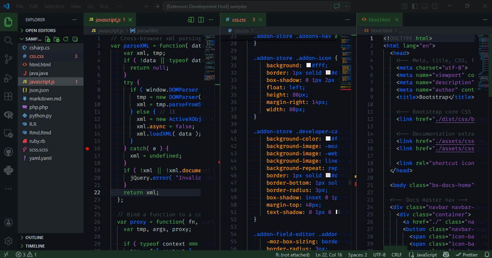

# Ninja Turtles VSCode Theme

A dark color theme for Visual Studio Code inspired by the Teenage Mutant Ninja
Turtles.

## Installation

1.  Open Visual Studio Code
2.  Go to the Extensions view (Ctrl+Shift+X)
3.  Search for "Ninja Turtles"
4.  Click Install
5.  Select "Ninja Turtles" from the Color Theme dropdown in File \> Preferences
    \> Color Theme

## Features

- Dark color scheme
- Inspired by the Teenage Mutant Ninja Turtles
- Optimized for coding with vibrant colors

## Contributing

Feel free to submit issues and enhancement requests.

## License

MIT
